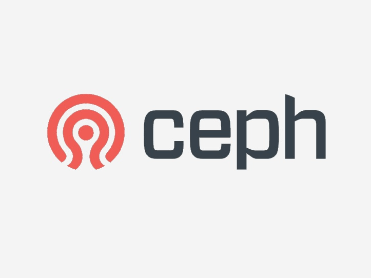

# Tổng quan về giải pháp lưu trữ CEPH

## 1. Tổng quát

**Ceph** là 1 project mã nguồn mở, cung cấp giải pháp data storage. Ceph cung cấp hệ thống lưu trữ phân tán mạnh mẽ, tính mở rộng, hiệu năng cao, khả năng chịu lỗi cao. Xuất phát từ mục tiêu, Ceph được thiết kết với khả năng mở rộng cao, hỗ trợ lưu trữ tới mức exabyte cùng với tính tương thích cao với các phần cứng có sẵn.

## 2. Lịch sử hình thành

- Argonaut – 03/07/2012 team CEPH đã phát triển và released bản Argonaut, bản phát hành "ổn định" lớn đầu tiên của Ceph. Bản phát hành này sẽ chỉ nhận được các bản sửa lỗi ổn định và cập nhật hiệu suất và các tính năng mới sẽ được lên lịch cho các bản phát hành trong tương lai.

- Bobtail (v0.56) – 01/01/2013 team CEPH đã phát triển và released bản Bobtail, bản phát hành "ổn định" lần thứ 2 của CEPH. Bản phát hành này tập trung chủ yếu vào sự ổn định, hiệu suất và khả năng nâng cấp từ loạt ổn định Argonaut trước đó (v0.48.x).

- Cuttlefish (v0.61) – 07/05/2013 team CEPH đã phát triển và released bản Cuttlefish, bản phát hành "ổn định" lần thứ 3 của CEPH. Bản phát hành này bao gồm một số cải tiến về tính năng và hiệu suất cũng như là bản phát hành ổn định đầu tiên có công cụ triển khai 'ceph-deploy' để thay đổi phương thức triển khai 'mkcephfs' trước đó.

- **Dumpling** (v0.67) – 14/08/2013, bản phát hành ổn định lần thứ 4. Bản này bao gồm global namespace, region support, a REST API cho việc monitoring

- **Emperor** (v0.72) – 09/01/2013, bản phát hành ổn định lần thứ 5. Bản này cung cấp tính năng mới multi-datacenter replication cho radosgw, cải thiện khả năng sử dụng và đạt được nhiều hiệu suất gia tăng và công việc tái cấu trúc nội bộ để hỗ trợ các tính năng sắp tới trong Firefly

- **Firefly** (v0.80) – 07/05/2014, bản phát hành ổn định lần thứ 6, bản phát hành này mang đến một số tính năng mới, bao gồm mã hóa, phân vùng bộ đệm (cache tiering), key/value OSD backend (thử nghiệm).

- **Giant** (v0.87) – 29/10/2014, bản phát hành ổn định lần thứ 7.

- **Hammer** (v0.94) – 07/04/2015, bản phát hành ổn định lần thứ 8.

- **Infernalis** (v9.2.0) – 06/01/2015 bản phát hành ổn định lần thứ 9.

- **Jewel** (v10.2.0) – 21/04/2016, nhóm phát triển Ceph đã phát hành Jewel, phiên bản Ceph đầu tiên trong đó CephFS được coi là ổn định. Các công cụ CephFS repair, disaster recovery tools đã được hoàn thành, một số chức năng bị tắt theo mặc định. Bản phát hành này bao gồm phụ trợ RADOS thử nghiệm mới có tên BlueStore, được lên kế hoạch làm phụ trợ lưu trữ mặc định trong các bản phát hành sắp tới.

- **Kraken** (v11.2.0) – 20/01/2017, nhóm phát triển Ceph đã phát hành Kraken. Định dạng lưu trữ BlueStore mới, được giới thiệu trong Jewel, hiện có định dạng trên disk ổn định và là một phần của bộ thử nghiệm. Mặc dù vẫn được đánh dấu là thử nghiệm, BlueStore đã sẵn sàng phát triển và nên được đánh dấu như vậy trong phiên bản tiếp theo Luminous.

- **Luminous** (v12.2.0) – 29/08/2017 nhóm phát triển Ceph đã phát hành Luminous. Trong số các tính năng khác, định dạng lưu trữ BlueStore (sử dụng raw disk thay vì hệ thống filesystem) hiện được coi là ổn định và được khuyến nghị sử dụng.

- **Mimic** (v13.2.0) – 01/06/2018, phát hành bản Mimic. Với việc phát hành Mimic, snapshots hiện ổn định khi được kết hợp với multiple MDS daemons và RESTful gateways frontend Beast được tuyên bố là ổn định và sẵn sàng để sử dụng.

- **Nautilus** (v14.2.0) – 19/03/2019 team CEPH đã phát triển và released bản **Nautilus**.

## 3. Tính cần thiết của CEPH

Hiện nay, các nền tảng hạ tầng đám mây public, private, hybird cloud dần trở nên phổ biến và to lớn. Ceph trở thành giải pháp nổi bật cho các vấn đề đang gặp phải.

Các yêu cầu mong muốn của một hệ thống lưu trữ (storage).

- Sử dụng thay thế lưu trữ trên ổ đĩa server thông thường.
- Sử dụng để backup, lưu trữ an toàn.
- Sử dụng để thực hiện triển khai các dịch vụ High Avaibility khác như Load Balancing for Web Server, DataBase Replication…
- Xây dựng Storage giải quyết bài toán lưu trữ cho dịch vụ Cloud hoặc phát triển lên Cloud Storage (Data as a Service).

-> **CEPH** có thể đáp ứng được các yêu cầu trên.

### Tham khảo

https://en.wikipedia.org/wiki/Ceph_(software)#History