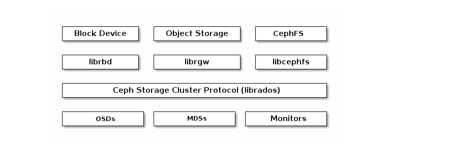
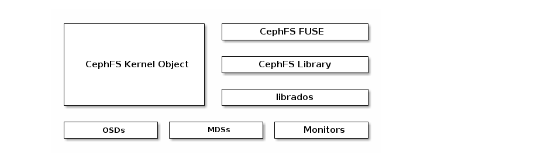
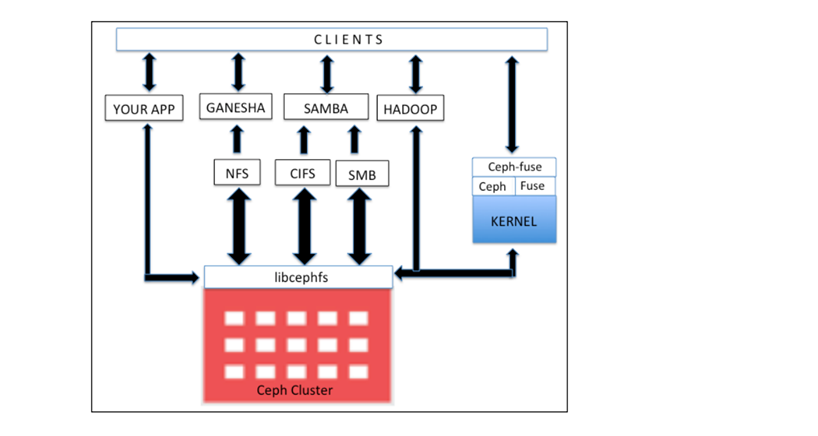
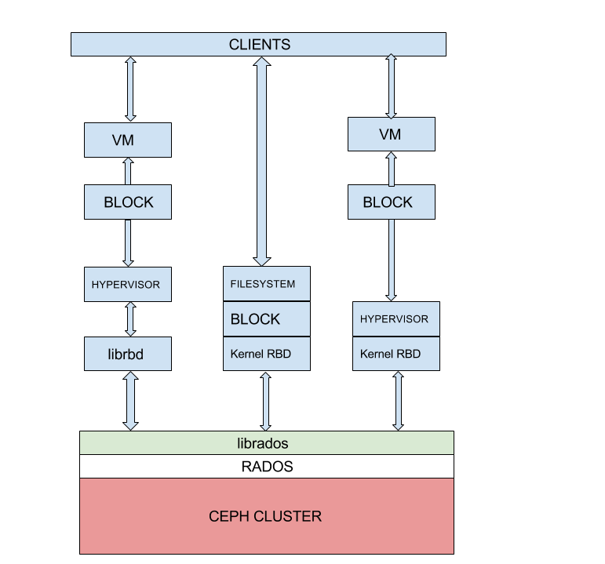
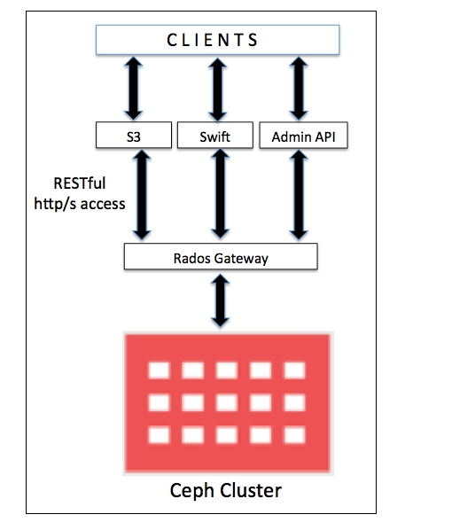

# Các kiểu tổ chức lưu trữ dữ liệu trong CEPH

Phía sâu bên trong, nội tại của CEPH data được phân bố dưới dạng object, thông qua một lớp phủ hay giao thức `Ceph Storage Cluster Protocol` (librados) mã hỗ trợ nhiều kiểu lưu trữ dữ liệu từ phía client khác nhau như: `Ceph fs`, `object storage`, `block device` mỗi kiểu ưu trữ trong CEPH lại có một service để quản lý kiểu giao tiếp đó.

## 1. Ceph Filesystem

Có thể hiểu đơn giản như là một kiểu tổ chức lưu trữ dữ liệu dạng truyền thống, hình dung như kiểu tổ chức thành các cây thư muc, ngoài cùng là thư mục cha sâu vào các lớp bên trong là thư mục con. Khi có một tác vụ đọc/ghi dữ liệu phải duyệt từ mức ngoài cùng vào bên trong để thấy được nơi cần thực hiện tác vụ đọc/ghi. Khi có sự thay đổi ảnh hướng tới toàn bộ hệ thống file system.

**Ceph filesystem** hay **CephFS**, là **POSIX-compliant filesystem** (POSIX thuật ngữ biểu diến các tổ chức dữ liệu dạng file trong CEPH), được sử dụng trong **Ceph storage cluster** sử dụng để lưu trữ user data. CephFS hỗ trợ tốt Linux kernel driver, kiến trúc CephFS tương thích tốt với các nền tảng Linux OS. CephFS lưu data và medata riêng biệt, cung cấp hiệu năng, tính bảo đảm cho app host nằm trên nó.

Trong **Ceph cluster**, **Cephfs lib** (libcephfs) chạy trên **Rados library** (librados) – giao thức thuộc Ceph storage - file, block, and object storage. Để sử dụng CephFS, cần ít nhất 1 Ceph metadata server (MDS) để chạy cluster nodes. Nếu có khi chỉ có 1 MDS server nó sẽ ảnh hưởng tính chống chịu lỗi Ceph. Khi cấu hình MDS, client có thể sử dụng CephFS theo nhiều cách. Để mount Cephfs, client cần sử dụng Linux kernel hoặc ceph-fuse (filesystem in user space) drivers provided by the Ceph community.

Bên cạnh, Client có thể sử dụng phần mềm thứ 3 như Ganesha cho NFS và Samba cho SMB/CIFS. Phần mềm cho phép tương tác với "libcephfs", bảo đảm lưu trữ user data phân tán trong **Ceph storage cluster**. CephFS có thể sử dụng cho Apache Hadoop File System (HDFS). Sử dụng libcephfs component to store data to the Ceph cluster. Để thực hiện, Ceph community cung cấp CephFS Java interface for Hadoop and Hadoop plugins. The libcephfs và librados components rất linh hoạt và ta có thể xây dựng phiên bản tùy chỉnh, tương tác với nó, xây dựng data bên dưới **Ceph storage cluster**.

**Một số ưu điểm:**

- Cung cấp an toàn dữ liệu mạnh hơn cho các ứng dụng quan trọng.

- Cung cấp lưu trữ hầu như không giới hạn cho các hệ thống tập tin.

- Các ứng dụng sử dụng hệ thống tệp có thể sử dụng Ceph FS (POSIX). Không cần tích hợp hoặc tùy chỉnh.

- Ceph tự động cân bằng hệ thống tập tin để cung cấp hiệu suất tối đa.

## 2. Ceph Block Device

**CEPH Block Device** hay **CEPH Block Storage** có thể hiểu một cách đơn giản, truyền thống khi ta muốn máy tính của ta có thêm dung lượng ổ đĩa ta đi mua thêm disk cắm vào máy tính chia phân vùng và sử dụng còn đối với CEPH Block Device cung cấp một thiết bị block storage - giống như một hard drive - qua network bạn không phải cắm thêm ổ đĩa vật lý thông qua dịch vụ bạn được cấp một thiết bị lưu trữ ảo ngay chính tạo máy của bạn. Quá trình truy xuất dữ liệu phải duyệt qua tất lần lượt các đơn vị tổ chức dữ liệu trong block đó dẫn tới phân mảnh dữ liệu.

Sử dụng nó như một ổ đĩa bình thường,có thể định dạng với một hệ thống tập tin và lưu trữ các tập tin trên đó, kết hợp nhiều thiết bị vào một mảng RAID.

**Một số ưu điểm:**

- Có thể dễ dàng live snapshots toàn bộ thiết bị cho mục đích sao lưu.

- Các thiết bị Block storage có thể được thay đổi kích thước theo nhu cầu ngày càng tăng (thin provisioning).

- Có thể dễ dàng gỡ và di chuyển các thiết bị block storage giữa các máy.

Với bản chất các RBD block chia thành nhiều object, phân tán trên toàn Ceph Cluster, cung cấp tính bảo đảm, hiệu năng cao. RBDhỗ trợ mức Linux kernel, và được tích hợp sẵn vơi Linux kernel, cung cấp các tính năng snapshot tốc độ cao, nhẹ, copy-on-write cloning. Hỗ trợ in-memory caching, nâng cao hiệu năng. Ceph RBD hỗ trợ image size tới 16EB. Image có thể là cung cấp dưới dạng ổ đĩa ảo, máy ảo.... Các công nghệ KVM, Zen hỗ trợ đầy đủ RBD, xử lý, lưu trữ trên các VM. Ceph block hỗ trợ đầy đủ các nền tảng ảo hóa mới OpenStack, LIO iSCSI Gateway, QEMU, libvirt, CloudStack...

**Ceph block device** hay **RADOS block device** (RBD); cung cấp giải pháp block storage tới physical hypervisors cung cấp cho VM.

Linux host hỗ trợ đầy đủ **Kernel RBD** (KRBD) và maps Ceph block devices sử dụng librados. RADOS sau đó lưu trữ Ceph block device objects trên các cụm trong mô hình phân tán. Khi Ceph block device được map Linux host, nó có thể sử dụng như 1 phần vùng RAW hoặc được đánh nhãn với filesystem.

RDB sử dụng librbd libraries để tận dụng tính nắng RADOS, cung cấp tính bảo đảo, phân tán, object-based block storage. Khi client ghi tới RDB, librbd libraries map data block tới object lưu trong CephCluster, chia data object, nhân bản tới cluster, nâng cao bảo đảm, tin cậy, hiệu năng. RBD phía trên RADOS layer hỗ trợ update trực tiếp tới object. Client có thể ghi, thêm, cắt trên object tồn tại. Kiểu RBD tối ưu giải pháp virtual machine volumes và việc thường xuyên ghi dữ liệu vào ổ đĩa.

## 3. Ceph Object Storage

**Ceph Object Storage** hiểu đơn giản đúng theo cái tên của nó quản lý đối tượng lưu trữ, quá trình thao tác với các object dữ liệu ở lớp dưới cùng của CEPH không được client thao tác thằng xuống mà thông qua một thành phần metadata quản lý tất cả các object ở dưới. Khi có thao tác với dữ liệu thì chỉ bị tác động tới object chứa data đó chứ không ảnh hưởng tới object khác trong tập rất nhiều object.

Ceph phân phối object storage system, cung cấp object storage interface thông qua Ceph's object gateway gọi là **RADOS gateway** (radosgw).

**RADOS gateway** (radosgw) sử dụng **librgw** (the RADOS gateway library) và librados, cho phép app thiết lập kết nối với **Ceph object storage**. Ceph cung cấp giải pháp lưu trữ ổn định, và có thể truy cập thông qua RESTful API.

The RADOS gateway cung cấp RESTful interface để sử dụng cho application lưu trữ data trên Ceph storage cluster. RADOS gateway interfaces gồm:

- Swift compatibility: Đây là chức năng lưu trữ đối tượng cho API OpenStack Swift.

- S3 compatibility: Đây là chức năng lưu trữ đối tượng cho Amazon S3 API.

- Admin API: API gốc, có thể cấp quyền cho hệ thống quản lý lưu trữ.

## Nguồn tham khảo

https://ceph.com/ceph-storage/file-system/ 

http://www.idz.vn/2018/06/tong-quan-ve-ceph.html