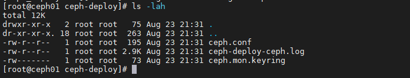

# Cài đặt CEPH phiên bản Luminous

**Chú ý:** Phần cài đặt bản Luminous cũng tương tự như cài đặt bản Nautilus

## 1. Mô hình triển khai


Trong đó:

- Ba node CEPH: CentOS 7 - 64bit.

- Disk: Mỗi node CEPH có 4 Disk. 1 Disk cài OS, 3 Disk lưu trữ dữ liệu cho Client.

- NICs:

    - `eth0`: SSH và cài đặt.

    - `eth1`: Kết nối thông tin giữa các node CEPH, đường cho clients kết nối.

    - `eth2`: Đồng bộ dữ liệu giữa các node CEPH.

- Phiên bản cài đặt: CEPH Nautilus.

## 2. IP Planning


## 3. Thiết lập ban đầu

**Update OS**

```
yum install epel-release -y
yum update -y
```

**Tắt Firewall và SELinux**

```
sudo systemctl disable firewalld
sudo systemctl stop firewalld
sudo systemctl disable NetworkManager
sudo systemctl stop NetworkManager
sudo systemctl enable network
sudo systemctl start network
sed -i 's/SELINUX=enforcing/SELINUX=disabled/g' /etc/sysconfig/selinux
sed -i 's/SELINUX=enforcing/SELINUX=disabled/g' /etc/selinux/config
```

**Cấu hình file Host**

```
cat << EOF >> /etc/hosts
10.10.40.57 ceph01
10.10.40.58 ceph02
10.10.40.59 ceph03
EOF
```

**Cài đặt NTPD**

```
yum install chrony -y
```

```
systemctl start chronyd
systemctl enable chronyd
systemctl restart chronyd
```

Kiểm tra đồng bộ thời gian:

```
chronyc sources -v
```

**Reboot lại các node CEPH**

```
init 6
```

## 4. Cài đặt CEPH

### Cài đặt ceph-deploy

```
yum install -y wget
wget https://download.ceph.com/rpm-nautilus/el7/noarch/ceph-deploy-2.0.1-0.noarch.rpm --no-check-certificate
rpm -ivh ceph-deploy-2.0.1-0.noarch.rpm
```

### Cài đặt python-setuptools để ceph-deploy có thể hoạt động ổn định.

```
curl https://bootstrap.pypa.io/ez_setup.py | python
```

### Kiểm tra cài đặt

```
ceph-deploy --version
```

Output trả về kết quả là `2.0.1` là OK

### Tạo SSH key

```
ssh-keygen
```


**Copy ssh key sang các node khác**

```
ssh-copy-id root@ceph01
ssh-copy-id root@ceph02
ssh-copy-id root@ceph03
```

### Tạo các thư mục ceph-deploy để thao tác cài đặt vận hành cluster

```
mkdir /ceph-deploy && cd /ceph-deploy
```

### Khởi tại file cấu hình cho cụm với node quản lý là ceph01

```
ceph-deploy new ceph01
```

**Kiểm tra lại thông tin folder ceph-deploy**



Trong thư mục bao gồm:

- `ceph.conf` : file config được tự động khởi tạo

- `ceph-deploy-ceph.log` : file log của toàn bộ thao tác đối với việc sử dụng lệnh ceph-deploy.

- `ceph.mon.keyring` : Key monitoring được ceph sinh ra tự động để khởi tạo Cluster.

- Bổ sung thêm vào file `ceph.conf`:

    - public network : Đường trao đổi thông tin giữa các node Ceph và cũng là đường client kết nối vào.

    - cluster network : Đường đồng bộ dữ liệu.

```
cat << EOF >> /ceph-deploy/ceph.conf
osd pool default size = 2
osd pool default min size = 1
osd crush chooseleaf type = 0
osd pool default pg num = 128
osd pool default pgp num = 128

public network = 10.10.40.0/24
cluster network = 10.10.41.0/24
EOF
```

### Cài đặt ceph trên toàn bộ các node ceph

**Lưu ý**: Nên sử dụng `byobu`, `tmux`, `screen` để cài đặt tránh hiện tượng mất kết nối khi đang cài đặt CEPH.

```
yum -y install byobu
```

- Cài đặt ceph lominous:

```
ceph-deploy install --release luminous ceph01 ceph02 ceph03
```