# Kết nối Client với Ceph Cluster

## 1. Mô hình triển khai

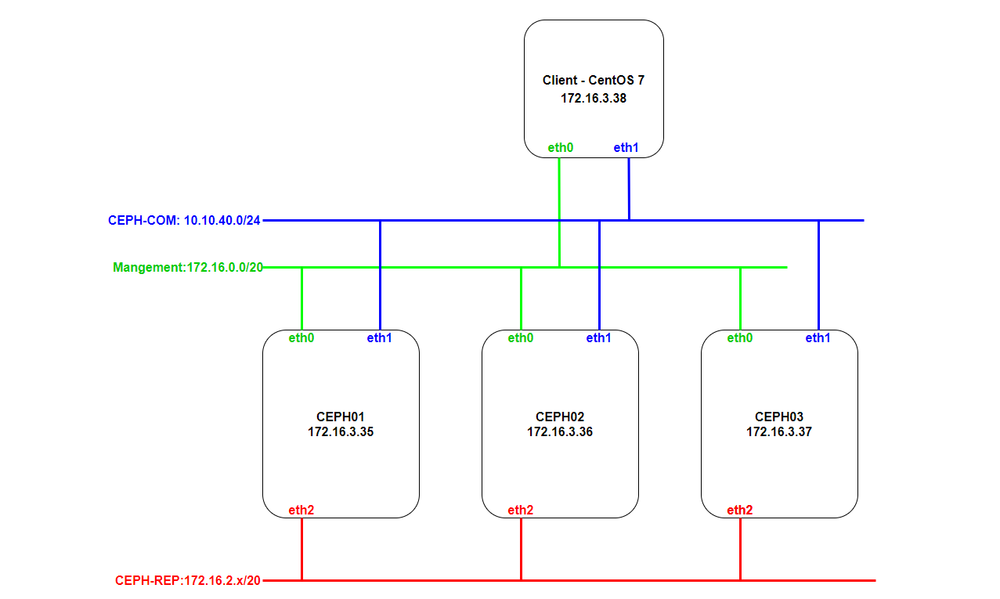

## 2. IP Planning

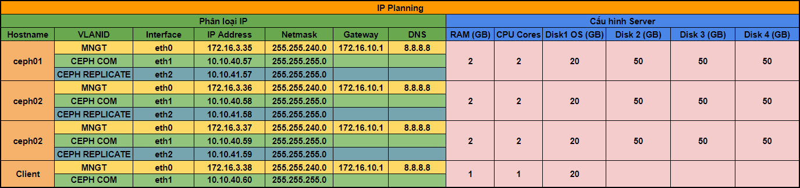

## 3. Các bước thực hiện

### Bước 1: Tính toán chỉ số replicate, PG tạo một pool image

**Đứng trên node CEPH để thực hiện:**

- Truy cập trang tính toán tự động số `PG` dựa trên thông tin hệ thống đã có.

```
https://ceph.com/pgcalc/
```

Trường hợp không truy cập được vào trang trên. Có thể truy cập vào link:

```
https://linuxkidd.com/ceph/pgcalc.html
```

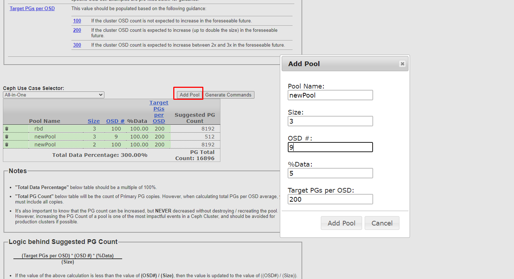

- Chọn `Generate Commands` để download file vừa tạo

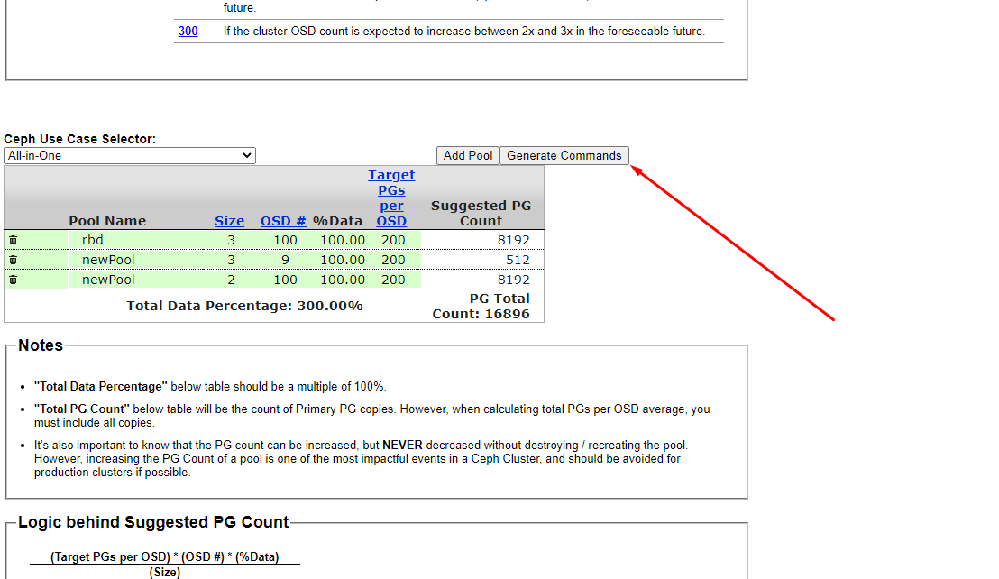

- Mở file vừa tạo ra để lấy các lệnh chạy trên node CEPH:

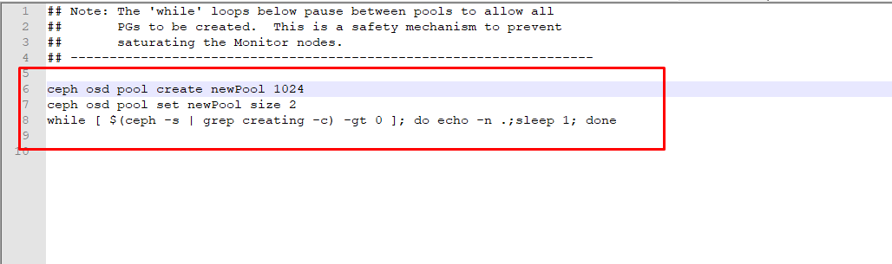

Kết quả:

```
[root@ceph01 ceph-deploy]# ceph osd pool create newPool 1024
For better initial performance on pools expected to store a large number of objects, consider supplying the expected_num_objects parameter when creating the pool.
[root@ceph01 ceph-deploy]# ceph osd pool set newPool size 2
set pool 1 size to 2
[root@ceph01 ceph-deploy]# while [ $(ceph -s | grep creating -c) -gt 0 ]; do echo -n .;sleep 1; done
```

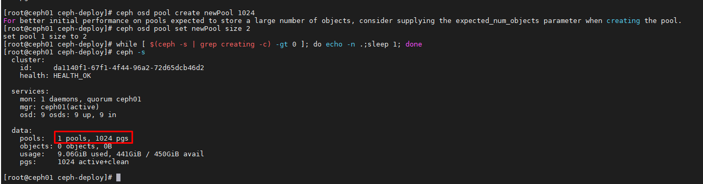

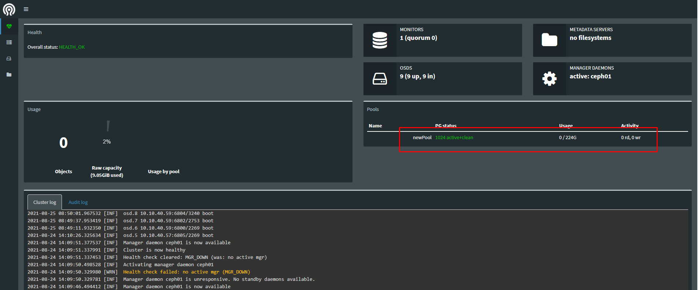

### Bước 2: Từ ceph server tạo 1 images (disk cho VM)

```
rbd create {pool-name}/{images} --size {size}

rbd info {pool-name}/{images}
```

Ví dụ: Ta vừa tạo ở trên pool là `newPool`, tiến hành tạo volume có size là 15GB

```
[root@ceph01 ~]# rbd create newPool/vol2 --size 15G
[root@ceph01 ~]# rbd info newPool/vol2
rbd image 'vol2':
        size 15GiB in 3840 objects
        order 22 (4MiB objects)
        block_name_prefix: rbd_data.ac5f6b8b4567
        format: 2
        features: layering, exclusive-lock, object-map, fast-diff, deep-flatten
        flags:
        create_timestamp: Wed Aug 25 09:19:41 2021
```

### Bước 3: Cài đặt CEPH client trên client linux

- Trên client cài đặt ceph client

```
yum install ceph-common -y
```

- Trên client download `ceph.conf` và `key` về `/etc/ceph/`

```
scp root@172.16.3.35:/etc/ceph/ceph.conf /etc/ceph/
scp root@172.16.3.35:/etc/ceph/{key-name}.keyring /etc/ceph/
```

`{key-name}`: Check ở ceph server

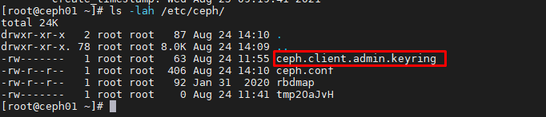

Kết quả:

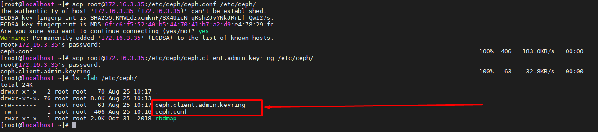

- Add `config` vào `rbdmap` trên `ceph client`

**Lưu ý:** Trường hợp trong `/etc/ceph/` đã có sẵn file cấu hình `rbdmap` thì cần move sang `rbdmap.bak` trước khi copy cấu hình vào.

```
mv /etc/ceph/rbdmap /etc/ceph/rbdmap.bak
```

```
echo "{pool-name}/{images}            id=admin,keyring=/etc/ceph/ceph.client.admin.keyring" >> /etc/ceph/rbdmap
```

```
echo "newPool/vol2          id=admin,keyring=/etc/ceph/ceph.client.admin.keyring" >> /etc/ceph/rbdmap
```


- Kiểm tra lại cấu hình:

```
sudo modprobe rbd
rbd feature disable {pool-name}/{images}  exclusive-lock object-map fast-diff deep-flatten
systemctl start rbdmap && systemctl enable rbdmap
```

```
sudo modprobe rbd
rbd feature disable newPool/vol2  exclusive-lock object-map fast-diff deep-flatten
systemctl start rbdmap && systemctl enable rbdmap
```

- Trên client xuất hiện phân cùng `rbd0` phân phối tự ceph server xuống có dung lượng 15 GB.

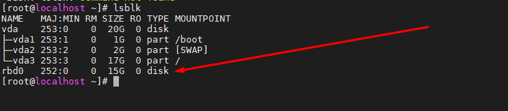

## Bước 3: Mount phân vùng mới

Kiểm tra các phân vùng đang được gắn trên VM

```
fdisk -l
```

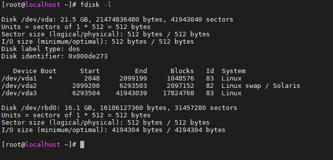

```
fdisk /dev/rbd0
```

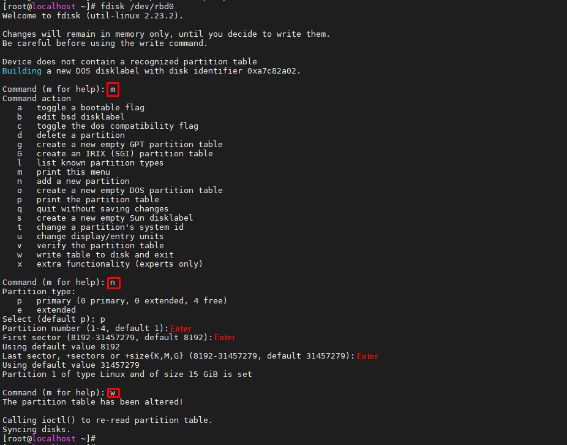

- Kiểm tra lại:

```
fdisk -l
```

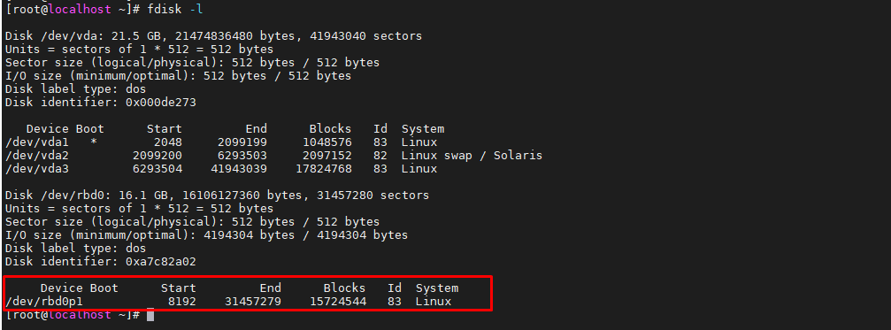

- Format lại ổ và phân vùng:

```
mkfs.ext4 /dev/rbd0p1
mkdir /data
mount /dev/rbd0p1 /data/
```

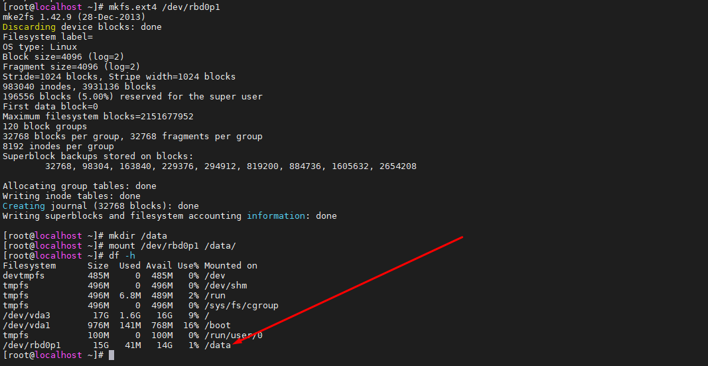

- Sửa trong `fstab` để khi khởi động lại VM thì phân vùng sẽ tự động khởi động theo:

```
[root@localhost ~]# blkid
/dev/vda1: UUID="d11fcfcb-8d11-458c-956f-52614441b70b" TYPE="ext4"
/dev/vda2: UUID="b4c9c319-04da-40f4-8684-fbda0acb5598" TYPE="swap"
/dev/vda3: UUID="19ad1de3-2fe1-439f-9e36-f3c156c2aaea" TYPE="xfs"
/dev/rbd0: PTTYPE="dos"
/dev/rbd0p1: UUID="dba003f9-828b-443c-8479-2114f4ac153e" TYPE="ext4"
```

```
echo UUID="dba003f9-828b-443c-8479-2114f4ac153e /data ext4 noauto 0 0" >> /etc/fstab
```

## 4. Extend volume

### Thực hiện trên node CEPH

```
rbd resize --size 2048 {pool-name}/{images} (to decrease)
rbd resize --size 2048 {pool-name}/{images} --allow-shrink (to increase)
```

Ví dụ resize `newPool/vol2` lên 30GB

```
rbd resize --size 30G newPool/vol2 --allow-shrink
```

Kết quả:

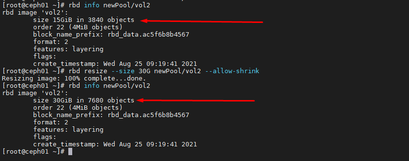

- Kiểm tra lại trên Client, sử dụng lệnh `lsblk`:

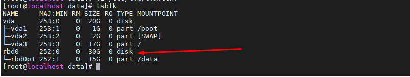

Phân vùng đã nhận đủ dung lượng khi tăng lên, nhưng dung lượng thực tế được sử dụng vẫn chưa đủ. Ta phải extend phía client lên.

### Resize lại phân vùng trên Client

- Cài đặt công cụ `parted`:

```
yum install parted -y
```

- Hiển hị thông tin phần vùng:

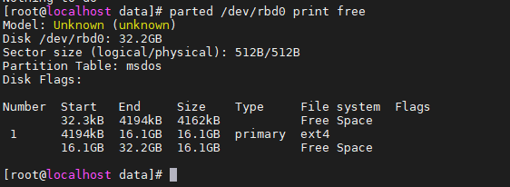

- Sử dụng các lệnh sau để resize lại phân vùng:

```
yum -y install cloud-utils-growpart
growpart /dev/rbd0 1
resize2fs /dev/rbd0p1
```

- Kết quả:

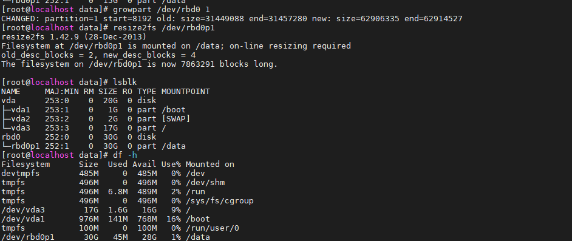

Kiểm tra lại dữ liệu bên trong phân vùng:

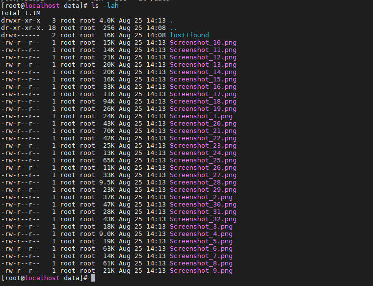