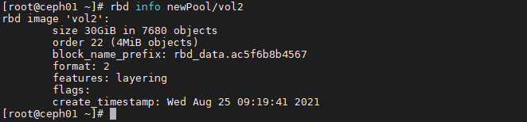

# Một số tập lệnh sử dụng trong CEPH

## Mục lục

[1. Lệnh ceph-deploy](#deploy)

[2. Kiểm tra service ceph](#service)

[3. Kiểm tra trạng thái hệ thống](#trangthai)

[4. Lệnh MGR service](#mgr)

[5. Lệnh thao tác với OSD](#osd)

[6. Các lệnh thao tác trên pool](#pool)

[7. Thao tác đối với RBD](#rbd)

[8. Các lệnh thao tác đối với Object](#object)

[9. Các lệnh thao tác xác thực trên Ceph](#xacthuc)

<a name="deploy"></a>
## 1. Lệnh ceph-deploy

- Install Ceph trên Client

```
ceph-deploy install {client}
```

```
ceph-deploy install --release luminous ceph01 ceph02 ceph03 
```

- Khởi tạo cụm

```
ceph-deploy mon create-initial
```

- Copy key admin và config

```
ceph-deploy --overwrite-conf admin {host}
```

```
ceph-deploy --overwrite-conf admin ceph01
```

**Tạo mới OSD**

+ Zapdisk

```
ceph-deploy disk zap {host} /dev/{disk}
```

```
ceph-deploy disk zap ceph01 /dev/sdb
```

+ Create OSD
```
ceph-deploy osd create --data /dev/{disk} {host}
```

```
ceph-deploy osd create --data /dev/sdb ceph01
```

- Tạo mới Node Mon

```
ceph-deploy mon create {host-name [host-name]...}
```

```
ceph-deploy mon create ceph02
```

- Xóa Node Mon

```
ceph-deploy mon destroy {host-name [host-name]...}
```

```
ceph-deploy mon create ceph02
```

- Tạo mới Node MGR

```
ceph-deploy mgr create {ceph-node}
```

```
ceph-deploy mgr create ceph01
```

- Push config mới qua các node client

```
ceph-deploy --overwrite-conf config push {host}
```

- Tạo mới node RGW

```
ceph-deploy rgw create {host}
```

<a name="service"></a>
## 2. Kiểm tra Service Ceph

### MON

- Tiến Trình Giám Sát ( Ceph Monitor – Ceph MON)

Thành phần tập trung vào trạng thái toàn cluster, giám sát trạng thái OSD, MON, PG, CRUSH map. Các cluster nodes sẽ giám sát, chia sẻ thông tin về nhưng thay đổi. Quá trình giám sát sẽ không lưu trữ dữ liệu (công việc này là của OSD).

```
systemctl start ceph-mon@$(hostname)
systemctl stop ceph-mon@$(hostname)
systemctl restart ceph-mon@$(hostname)
```

Ví dụ

```
systemctl restart ceph-mon@ceph01
```

### OSD

- Đa phần Ceph Cluster được thực hiện bởi tiến trình Ceph OSD. Ceph OSD lưu tất cả dữ liệu người dùng dạng đối tượng. Ceph cluster bao gồm nhiều OSD. CEPH có cơ chế phân phối object vào các OSD khác nhau đảm bảo tính toàn vẹn và sẵn sàng của dữ liệu.

- OSD trên node nào thì đứng trên node đó để kiểm tra trạng thái của OSD đó.

**Xác định ID của OSD:**

```
ceph osd tree
```


```
systemctl stop ceph-osd@{osd-id}
systemctl start ceph-osd@{osd-id}
systemctl restart ceph-osd@{osd-id}
```

```
systemctl restart ceph-osd@5
```


### MDS

- Ceph MDS tập trung vào Metadata Server và yêu cầu riêng cho CephFS, và một số storage methods block; object-based storage không yêu cầu MDS services.

```
systemctl restart ceph-mds@$(hostname)
```

```
systemctl status ceph-mds@ceph02
```


### RGW

- Ceph phân phối object storage system, cung cấp object storage interface thông qua Ceph's object gateway, được biệt là RADOS gateway (radosgw).

```
systemctl status ceph-radosgw@rgw.$(hostname).service
```

```
systemctl status ceph-radosgw@rgw.ceph01.service
```


### MGR

MGR chạy song song monitor daemons với để cung cấp giám sát và giao diện bổ sung cho hệ thống giám sát và quản lý từ bên ngoài.

```
systemctl start ceph-mgr@$(hostname)
systemctl restart ceph-mgr@$(hostname)
systemctl status ceph-mgr@$(hostname)
```

```
systemctl status ceph-mgr@ceph01
```


<a name="trangthai"></a>
## 3. Kiểm tra trạng thái hệ thống

- Hiển thị trạng thái cụm Ceph

```
ceph -s
```

```
ceph health
```

- Hiển thị chi tiết trạng thái cụm Ceph

```
ceph -s
```

- Hiển thị trạng thái cụm Ceph theo giời gian thực

```
ceph -w
```

- Kiểm tra trạng thái sử dụng disk của mỗi pool

```
ceph df
```

- Kiểm tra trạng thái sử dụng disk của mỗi pool theo Object

```
rados df
```


<a name="mgr"></a>
## 4. Lệnh MGR service

- Kiểm tra thông tin các module của MGR

```
ceph mgr dump
```

Hiển thị tất cả các module mà hệ thống CEPH hỗ trợ cho việc giám sát, quản lý từ bên ngoài, như zabbix, influx, prometheus...


- Enable các module MGR

```
ceph mgr module enable {module}
```

```
ceph mgr module enable zabbix
```


<a name="osd"></a>
## 5. Lệnh thao tác với OSD

- Kiểm tra OSD đươc tạo từ phân vùng ổ LVM nào trên server vật lý.

```
ceph-volume lvm list
```

OSD nào thì kiểm tra trên node đó.


- Hiển trị trạn thái các OSD trong cụm.

```
ceph osd stat
```


- Hiển thị tình trạng used, r/w, state của các osd

```
ceph osd status
```


- Hiển thị Crushmap OSD

```
ceph osd tree
ceph osd crush tree
ceph osd crush tree --show-shadow
```


- Kiểm tra chi tiết location của 1 OSD

```
ceph osd find {osd-id}
```

```
ceph osd find 1
```


- Kiểm tra chi tiết metadata của 1 OSD

```
ceph osd metadata {osd-id}
```

```
ceph osd metadata 1
```


- Benchmark OSD

```
ceph tell osd.{osd-id} bench
```

```
ceph tell osd.1 bench
```


- Hiển thị trạng thái sử dụng của các OSD

```
ceph osd df 
ceph osd df tree
```


- Hiển thị latency Aplly, Commit data trên các OSD

```
ceph osd perf
```


- Xóa 1 osd ra khỏi cụm Ceph (Thực hiện trên node của OSD đó)

```
i={osd-id}
ceph osd out osd.$i
ceph osd down osd.$i
systemctl stop ceph-osd@$i
ceph osd crush rm osd.$i
ceph osd rm osd.$i
ceph auth del osd.$i
```

```
ceph osd out osd.1
ceph osd down osd.1
systemctl stop ceph-osd@1
ceph osd crush rm osd.1
ceph osd rm osd.1
ceph auth del osd.1
```

<a name="pool"></a>
## 6. Các lệnh thao tác trên pool

- Tạo pool (phải tính toán đúng tham số về replicate, PG)

```
ceph osd pool create {pool-name} {pg-num} [{pgp-num}] [replicated] \
     [crush-ruleset-name] [expected-num-objects]
```

- Enable aplication pool

```
osd pool application enable {pool-name} {application}
```

```
osd pool application enable newPool rbd
```

- Hiển thị toàn bộ tham số của các pool

```
ceph osd pool ls detail
```


- Hiện thị tham số của 1 pool

```
ceph osd pool get {pool-name} all
````

```
ceph osd pool get newPool all
```


- Điều chỉnh lại giá trị của pool

```
ceph osd pool set {pool-name} {key} {value}
```

- Xóa pool

```
ceph osd pool delete {pool-name}
```

<a name="rbd"></a>
## 7. Thao tác đối với RBD

- Hiển thị các images trong pool

```
rbd ls {pool-name}
```

```
rbd ls newPool
```


- Create 1 images

```
rbd create {pool-name}/{images} --size {size}
```

```
rbd create images/vol16 --size 15G
```

- Hiển thị chi tiết images

```
rbd info {pool-name}/{images}
```

```
rbd info newPool/vol2
```



- Hiển thị dung lượng thực tế của images

```
rbd diff {pool-name}/{images} | awk '{SUM += $2} END {print SUM/1024/1024 " MB"}'
```

```
rbd diff newPool/vol2 | awk '{SUM += $2} END {print SUM/1024/1024 " MB"}'
```


- Hiển thị images đang được mapped (trên Client)

```
rbd showmapped
```

- Xóa images

```
rbd rm {pool-name}/{images}
```

- Create snapshot

```
rbd snap create {pool-name}/{images}@{snap-name}
```

```
rbd snap create newPool/vol2@vol2snap1
```

- Kiểm tra tất cả các bản snapshot của 1 volume

```
rbs snap ls {pool-name}/{images}
```

```
rbd snap ls newPool/vol2
```


- Protect bản snapshot

```
rbd snap protect {pool-name}/{images}@{snap-name}
```

```
rbd snap protect newPool/vol2@vol2snap1
```

- Roolback snapshot (Cho images trở về tại thời điểm snapshot)

```
rbd snap rollback {pool-name}/{images}@{snap-name}
```

```
rbd snap rollback newPool/vol2@vol2snap1
```

- Clone snapshot thành 1 images mới

```
rbd clone {pool-name}/{images}@{snap-name} {pool-name}/{child-images}
```

```
rbd clone newPool/vol2@vol2snap1 newPool/vol8clone
```

- Kiểm tra các images được clone từ snapshot

```
rbd children {pool-name}/{images}@{snap-name}
```

```
rbd children newPool/vol2@vol2snap1
```


- Tách hẳn images mới ra khỏi images parent

```
rbd flatten {pool-name}/{child-images}
```

```
rbd flatten newPool/vol8clone
```


- Unprotect bản snapshot

```
rbd snap unprotect {pool-name}/{images}@{snap-name}
```

```
rbd snap unprotect newPool/vol2@vol2snap1
```

- Xóa 1 bản snapshot

```
rbd snap rm {pool-name}/{images}@{snap-name}
```

```
rbd snap rm newPool/vol2@vol2snap1
```

- Xóa toàn bộ snapshot của 1 volume

```
rbd snap purge {pool-name}/{images}
```

```
rbd snap purge newPool/vol2
```


- Export volume

```
rbd export --rbd-concurrent-management-ops 20 --pool={pool-name} {images} {images}.img
```

```
rbd export --rbd-concurrent-management-ops 20 --pool=newPool vol2 vol2export.img
```

<a name="object"></a>
## 8. Các lệnh thao tác đối với Object


- Show toàn bộ pool name

```
rados lspools
```

- Show toàn bộ Object trên cụm

```
rados -p {pool-name} ls
```

- Upload Object lên cụm Ceph

```
rados -p {pool-name} put {object-file}
```

- Download Object từ cụm Ceph

```
rados -p {pool-name} get {object-file}
```

- Xóa 1 Object cụm Ceph

```
rados -p {pool-name} rm {object-file}
```

- Kiểm tra các client kết nối đến Object

```
rados -p {pool-name} listwatchers {object-file}
```

- Benchmark Object bằng rados bench

```
rados -p {pool-name} listwatchers {object-file}
```

<a name="xacthuc"></a>
## 9. Các lệnh thao tác xác thực trên Ceph

- Hiển thị toàn bộ các key authen của cụm Ceph

```
ceph auth list
```

- Create hoặc get key

```
ceph auth get-or-create {key-name} mon {permission} osd {permission} mds {permission} > {key-name}.keyring
```

- Cập nhật permission key đã có

```
ceph auth caps {key-name} mon {permission} osd {permission} mds {permission}
```

- Xóa key

```
ceph auth delete {key-name}
```