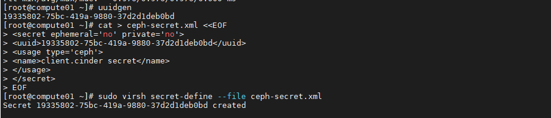
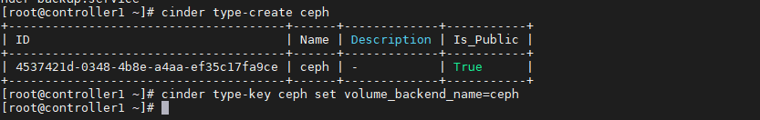
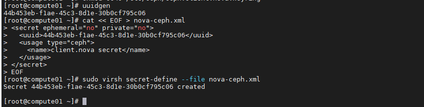

# Cài đặt và tích hợp CEPH với OpenStack

## 1. IP Planning


- Tham khảo việc cài đặt 3 Node CEPH [tại đây](https://github.com/quanganh1996111/ceph/tree/main/ceph/thuc-hanh/docs)

- Tham khảo việc cài đặt OpenStack gồm 1 node Controller và 2 node Compute [tại đây](https://github.com/quanganh1996111/openstack/blob/main/install-openstack/docs/1-install-openstack-manual.md)

## 2. Các bước triển khai

Về cơ bản Openstack có 3 service có thể tích hợp để lưu trữ xuống dưới CEPH.

- Glance (images): Lưu trữ các images xuống CEPH.

- Cinder (volume): Lưu trữ các ổ đĩa của máy ảo được tạo ra trên Openstack xuống dưới CEPH.

- Nova (conmpute): Mặc định khi VM được tạo sẽ sinh ra một file lưu thông tin file disk của VM đó trên chính node compute đó, có thể tích hợp xuống CEPH thông qua một `symlink`.

## 3. Phần Chuẩn bị cài đặt.

Thực hiện chung cho việc tích hợp các thành phần Openstack vào CEPH.

### 3.1. Cài đặt lib ceph python cho các node Controller và Compute

- `python-rbd`: Thư viện hỗ trợ ceph.

- `ceph-common`: Kết nối client vào ceph cluster.

```
yum install -y python-rbd ceph-common
```

### 3.2. Tạo pool trên CEPH (Thực hiện trên node CEPH)

Tùy thuộc và nhu cầu tích hợp để tạo những pool khác nhau với mục đích quản lý khác nhau. Sử dụng công cụ tính toán pool do CEPH hỗ trợ.

https://linuxkidd.com/ceph/pgcalc.html

- Tạo pool theo tài nguyên của cụm CEPH


- Generate ra lệnh để tiến hành cài đặt:


- Chạy các câu lệnh ở trong file vừa được Generate để khởi tạo pool trên CEPH

```
ceph osd pool create volumes 1024
ceph osd pool set volumes size 2
while [ $(ceph -s | grep creating -c) -gt 0 ]; do echo -n .;sleep 1; done

ceph osd pool create backup 64
ceph osd pool set backup size 2
while [ $(ceph -s | grep creating -c) -gt 0 ]; do echo -n .;sleep 1; done

ceph osd pool create vms 64
ceph osd pool set vms size 2
while [ $(ceph -s | grep creating -c) -gt 0 ]; do echo -n .;sleep 1; done

ceph osd pool create images 128
ceph osd pool set images size 2
while [ $(ceph -s | grep creating -c) -gt 0 ]; do echo -n .;sleep 1; done
```

- Thông báo lỗi khi tạo pool:


Mặc định CEPH không cho xóa pool để tránh rủi ra mất mát data khi xóa nhầm pool. Để có thể xóa được pool phải chỉnh sửa file ceph config trong thư mục ceph-deploy và overwrite config tới các node khác thông qua ceph-deploy.

Chỉnh sửa cấu hình trong file `/ceph-deploy/ceph.conf`

Thêm cấu hình:

```
mon_allow pool delete = true
```

- Muốn giới hạn số lượng PG trên OSDs, ta thêm:

```
mon max pg per osd  = 500

hoặc

mon_max_pg_per_osd = 500
```

Trong config của CEPH có thể có dấu _ hoặc không có đều OK.

Restart service ceph MON, ceph MGR.

```
systemctl restart ceph-mon@ceph01
systemctl restart ceph-mgr@ceph01
```

**Sau mỗi lần chỉnh sửa config hoặc key chỉ cần đứng trong thực mục ceph-deploy copy đè config lên các node CEPH khác**

- Copy đè key sang các node CEPH khác:

```
ceph-deploy --overwrite-conf admin ceph01 ceph02 ceph03
```

- Copy đè `config`

```
ceph-deploy --overwrite-conf config push ceph01 ceph02 ceph03
```

- Tiến hành khởi tạo lại các Pool như trên. Kết quả:


- Khởi tạo ban đầu trước khi sử dụng pool

```
rbd pool init volumes
rbd pool init vms
rbd pool init images
rbd pool init backup
```

- Copy cấu hình qua các node Controller, Compute của OpenStack

```
ssh 172.16.2.72 sudo tee /etc/ceph/ceph.conf < /etc/ceph/ceph.conf
ssh 172.16.2.73 sudo tee /etc/ceph/ceph.conf < /etc/ceph/ceph.conf
ssh 172.16.2.74 sudo tee /etc/ceph/ceph.conf < /etc/ceph/ceph.conf
```

## 4. Tích hợp CEPH làm backend cho glance - images

#### Bước 1: Thực hiện trên node CEPH

Ở trong CEPH key chính là một thành phần quan trọng dùng để xác thực, phân quyền cho một đối tượng sở hữu key đó với các service, pool trong CEPH.

- Tạo key `glance`

```
ceph auth get-or-create client.glance mon 'allow r' osd 'allow class-read object_prefix rbd_children, allow rwx pool=images'
```


Tạo key glance cho phép `read` các thông tin service `mon`, lấy đầy đủ thông tin về service `OSD`, phần quyền `read/write/excute` đối với pool có tên là `images`.

- Chuyển key `glance` sang node `glance` (glance được cài đặt trên node Controller)

```
ceph auth get-or-create client.glance | ssh 172.16.2.72 sudo tee /etc/ceph/ceph.client.glance.keyring
```


#### Bước 2: Thực hiện trên node Contoller

- Set quyền cho các key vừa chuyển từ node CEPH sang.

```
sudo chown glance:glance /etc/ceph/ceph.client.glance.keyring
sudo chmod 0640 /etc/ceph/ceph.client.glance.keyring
```


#### Bước 3: Thêm, chỉnh sửa cấu hinh `/etc/glance/glance-api.conf` trên node Controller

```
[DEFAULT]
show_image_direct_url = True

[glance_store]
show_image_direct_url = True
default_store = rbd
stores = file,http,rbd
rbd_store_pool = images
rbd_store_user = glance
rbd_store_ceph_conf = /etc/ceph/ceph.conf
rbd_store_chunk_size = 8
```


#### Bước 4: Restart lại dịch vụ glance trên node Controller

```
systemctl restart openstack-glance-*
```

#### Bước 5: Upload images và kiểm tra thực hiện trên node CTL

- Đứng từ thư mục `/root`:

```
source admin-openrc
```

```
wget http://download.cirros-cloud.net/0.3.4/cirros-0.3.4-x86_64-disk.img
openstack image create "cirros-ceph" \
--file cirros-0.3.4-x86_64-disk.img \
--disk-format qcow2 --container-format bare \
--public
```


- Kiểm tra trên node CEPH:

```
rbd -p images ls
```


## 5. Tích hợp CEPH làm backend cho cinder-volume và cinder-backup

#### Bước 1: Thực hiện trên node CEPH

- Di chuyển vào thưc mục ceph-deploy

```
cd /ceph-deploy/
```

- Tạo key `cinder`

```
ceph auth get-or-create client.cinder mon 'allow r, allow command "osd blacklist", allow command "blacklistop"' osd 'allow class-read object_prefix rbd_children, allow rwx pool=volumes, allow rwx pool=images' > ceph.client.cinder.keyring
```


- Tạo key `cinder-backup`

```
ceph auth get-or-create client.cinder-backup mon 'profile rbd' osd 'profile rbd pool=backup' > ceph.client.cinder-backup.keyring
```


- Chuyển key `cinder` và key `cinder-backup` sang các node cài đặt Cinder (node Controller).

```
ceph auth get-or-create client.cinder | ssh 172.16.3.24 sudo tee /etc/ceph/ceph.client.cinder.keyring

ceph auth get-or-create client.cinder-backup | ssh 172.16.3.24 sudo tee /etc/ceph/ceph.client.cinder-backup.keyring
```


- Chuyển key `cinder` sang các node Compute

```
ceph auth get-or-create client.cinder | ssh 172.16.3.25 sudo tee /etc/ceph/ceph.client.cinder.keyring
ceph auth get-or-create client.cinder | ssh 172.16.3.26 sudo tee /etc/ceph/ceph.client.cinder.keyring

ceph auth get-key client.cinder | ssh 172.16.3.25 tee /root/client.cinder
ceph auth get-key client.cinder | ssh 172.16.3.26 tee /root/client.cinder
```


#### Bước 2: Thực hiện trên node CTL

- Set quyền cho các key

```
sudo chown cinder:cinder /etc/ceph/ceph.client.cinder*
sudo chmod 0640 /etc/ceph/ceph.client.cinder*
```


#### Bước 3: Thao tác trên node Compute

Khởi tạo 1 `uuid` mới cho cinder (UUID sử dụng chung cho các Compute nên chỉ cần tạo lần đầu tiên trên 1 node Compute sau đó sẽ copy sang các node khác).

```
uuidgen

eaa1e19c-a781-41bb-9e09-f1c9e9298d6a
```

- Tạo file `xml` cho phép Ceph RBD (Rados Block Device) xác thực với libvirt (KVM) thông qua uuid vừa tạo. Đoạn `xml` này có ý nghĩa định nghĩa khi xác thực mà gặp key có `uuid` vừa tạo thì sẽ áp dụng kiểu ceph cho `cinder`.

```
cat > ceph-secret.xml <<EOF
<secret ephemeral='no' private='no'>
<uuid>eaa1e19c-a781-41bb-9e09-f1c9e9298d6a</uuid>
<usage type='ceph'>
	<name>client.cinder secret</name>
</usage>
</secret>
EOF
```

Chạy lệnh

```
sudo virsh secret-define --file ceph-secret.xml
```



- Gán giá trị của `client.cinder` cho `uuid`

```
virsh secret-set-value --secret eaa1e19c-a781-41bb-9e09-f1c9e9298d6a --base64 $(cat /root/client.cinder)
```

#### Bước 4: Chỉnh sửa, bổ sung cấu hình trên node Controller

```
vi /etc/cinder/cinder.conf
```

- Thêm đoạn sau vào `[DEFAULT]`

```
[DEFAULT]
notification_driver = messagingv2
enabled_backends = ceph
glance_api_version = 2
backup_driver = cinder.backup.drivers.ceph
backup_ceph_conf = /etc/ceph/ceph.conf
backup_ceph_user = cinder-backup
backup_ceph_chunk_size = 134217728
backup_ceph_pool = backups
backup_ceph_stripe_unit = 0
backup_ceph_stripe_count = 0
restore_discard_excess_bytes = true
host=ceph
```

- Thêm vào cuối file:

```
[ceph]
volume_driver = cinder.volume.drivers.rbd.RBDDriver
volume_backend_name = ceph
rbd_pool = volumes
rbd_ceph_conf = /etc/ceph/ceph.conf
rbd_flatten_volume_from_snapshot = false
rbd_max_clone_depth = 5
rbd_store_chunk_size = 4
rados_connect_timeout = -1
rbd_user = cinder
rbd_secret_uuid = eaa1e19c-a781-41bb-9e09-f1c9e9298d6a // secret key vừa tạo ở trên
report_discard_supported = true
```

- Enable `cinder-backup` và restart dịch vụ `cinder`

```
systemctl enable openstack-cinder-backup.service
systemctl start openstack-cinder-backup.service
systemctl restart openstack-cinder-backup.service
systemctl status openstack-cinder-backup.service
```

- Restart lại service `cinder` trên node Controller

```
systemctl restart openstack-cinder-api.service openstack-cinder-volume.service openstack-cinder-scheduler.service openstack-cinder-backup.service
```

- Tạo volume type node Controller



#### Bước 5: Restart lai dich vu nova-compute trên node COM

```
systemctl restart openstack-nova-compute
```

#### Bước 6: Tạo volume, VM và kiểm tra

```
rbd -p volumes ls
```

#### Bước 7: Tích hợp các node Compute còn lại

Sau khi thao tác cấu hình tích hợp node COM1 thực hiện cấu hình tích hớp các node COM còn lại.

**Trên node CEPH**

- Cấu hình SSH key, chuyển key và nhập password cho Compute

```
ssh-copy-id root@172.16.3.26
```

- Chuyển key `cinder` tới node `Compute`

```
ceph auth get-or-create client.cinder | ssh 172.16.3.26 sudo tee /etc/ceph/ceph.client.cinder.keyring
ceph auth get-key client.cinder | ssh 172.16.3.26 tee /root/client.cinder.key
```

**Trên node COM**

Sử dụng key: `eaa1e19c-a781-41bb-9e09-f1c9e9298d6a` đã tạo ở node Compute01

```
cat > secret.xml <<EOF
<secret ephemeral='no' private='no'>
  <uuid>eaa1e19c-a781-41bb-9e09-f1c9e9298d6a</uuid>
  <usage type='ceph'>
    <name>client.cinder secret</name>
  </usage>
</secret>
EOF
```

```
sudo virsh secret-define --file secret.xml
```

- Gán giá trị cho file cinder key

```
virsh secret-set-value --secret eaa1e19c-a781-41bb-9e09-f1c9e9298d6a --base64 $(cat client.cinder.key)
```

- Restart lại service nova

```
systemctl restart openstack-nova-compute
```

## 6. Tích hợp CEPH làm backend cho nova-compute

Mặc định các VM được tạo từ images sẽ lưu file disk ngay chính trên node COM, Việc tích hợp này cho phép file disk này được tạo 1 symlink lưu trữ dưới Ceph.

#### Bước 1: Thực hiện trên node CEPH

- Tạo `keyring` cho `nova`

```
ceph auth get-or-create client.nova mon 'allow r' osd 'allow class-read object_prefix rbd_children, allow rwx pool=vms, allow rx pool=images' -o /etc/ceph/ceph.client.nova.keyring 
```

- Copy key `nova` sang các node Compute


#### Bước 2: Thao tác trên node Compute

- Set quyền key trên node Compute

```
chgrp nova /etc/ceph/ceph.client.nova.keyring
chmod 0640 /etc/ceph/ceph.client.nova.keyring
```

- Tạo key UUID. UUID sử dụng chung cho các COM nên chỉ cần tạo lần đầu tiên.

```
uuidgen
```

```
e7e132b3-ce49-4720-bc76-d1fb96efa47b
```

- Tạo file `xml` cho phép Ceph RBD (Rados Block Device) xác thực với libvirt thông qua uuid vừa tạo

```
cat << EOF > nova-ceph.xml
<secret ephemeral="no" private="no">
  <uuid>e7e132b3-ce49-4720-bc76-d1fb96efa47b</uuid>
  <usage type="ceph">
    <name>client.nova secret</name>
  </usage>
</secret>
EOF
```

Đoạn `xml` này có ý nghĩa định nghĩa khi xác thực mà gặp key có `uuid` là `e7e132b3-ce49-4720-bc76-d1fb96efa47b` thì sẽ áp dụng kiểu `ceph` cho nova.



- Gán giá trị của `client.nova` cho `uuid`

```
virsh secret-set-value --secret e7e132b3-ce49-4720-bc76-d1fb96efa47b --base64 $(cat /root/client.nova)
```

#### Bước 4: Chỉnh sửa, bổ sung cấu hình trên node Compute

- Chỉnh sửa nova.conf trên COM `/etc/nova/nova.conf`

```
[libvirt]
images_rbd_pool=vms
images_type=rbd
rbd_secret_uuid=e7e132b3-ce49-4720-bc76-d1fb96efa47b
rbd_user=nova
images_rbd_ceph_conf = /etc/ceph/ceph.conf
```

- Restart service nova

```
systemctl restart openstack-nova-compute
```

#### Bước 5: Tạo VM từ images để kiểm tra

```
rbd -p vms ls
rbd -p compute info <name_disk>
```

#### Bước 6: Tích hợp các node Compute còn lại

Sau khi thao tác cấu hình tích hợp node `compute01` thực hiện cấu hình tích hớp các node compute còn lại.

- Chuyển key `nova` tới node `Compute`

```
ceph auth get-or-create client.nova | ssh 172.16.3.26 sudo tee /etc/ceph/ceph.client.nova.keyring
ceph auth get-key client.nova | ssh 172.16.3.26 tee /root/client.nova.key
```

- Trên node Compute:

Tạo file secret key

```
cat << EOF > nova-ceph.xml
<secret ephemeral="no" private="no">
  <uuid>e7e132b3-ce49-4720-bc76-d1fb96efa47b</uuid>
  <usage type="ceph">
    <name>client.nova secret</name>
  </usage>
</secret>
EOF
```

```
sudo virsh secret-define --file nova-ceph.xml
```

- Gán giá trị của `client.nova` cho `uuid`

```
virsh secret-set-value --secret e7e132b3-ce49-4720-bc76-d1fb96efa47b --base64 $(cat /root/client.nova)
```

- Chỉnh sửa `nova.conf` trên compute mới `/etc/nova/nova.conf`

```
[libvirt]
images_rbd_pool=vms
images_type=rbd
rbd_secret_uuid=e7e132b3-ce49-4720-bc76-d1fb96efa47b
rbd_user=nova
images_rbd_ceph_conf = /etc/ceph/ceph.conf
```

- Restart service nova

```
systemctl restart openstack-nova-compute
```